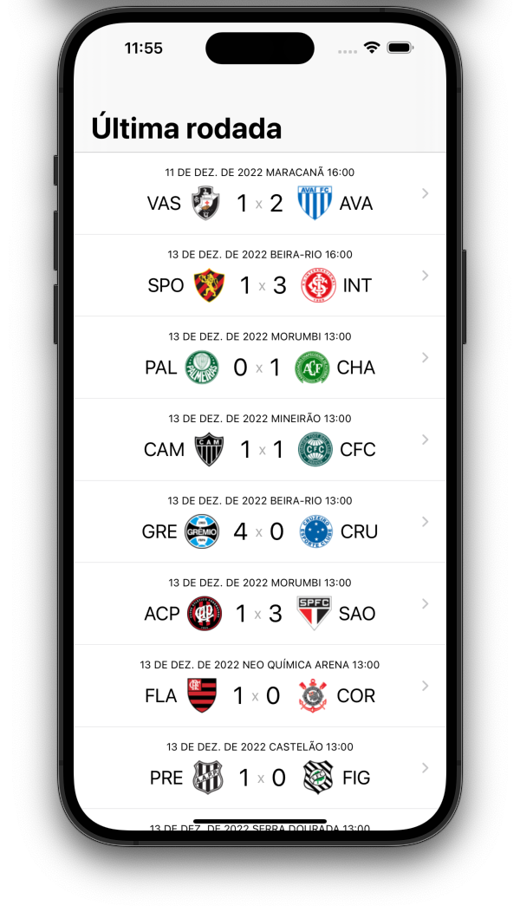
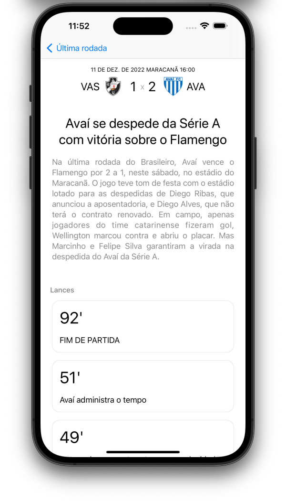

## Brasileirão

[](https://github.com/SelecaoGlobocom/antonyalkmim/actions/workflows/tests.yml)


Este é um projeto de testes usado para aplicar novos conceitos com o objetivo de aprendizagem.

## Screenshots

<p align="center">
  
  
</p>


## Requisitos

1. Xcode 14.0

## Como rodar o projeto
1. Clone este repositório
2. Instale as ferramentas de desenvolvimento: `brew bundle && bundle install`
3. Selecione o target `BrasilianLeague` e execute o aplicativo no simulator


#### Snapshot Testing
⚠️ Os snapshots de teste foram registrados e validados utilizando o dispositivo `iPhone 14 Pro Max iOS 16.0`. Rodar os testes em dispositivos de diferente tamanho de tela e/ou versão de sistema operacional pode fazer com que os testes falhem.

#### Automação
Neste projeto está configurado o Github Actions juntamente com o fastlane para que em todos os pull-requests sejam executado todos os testes de unidade e de UI. Para executar todos os testes utilizando o fastlane:
```sh
bundle exec fastlane ios tests
```

## Arquitetura

Esse projeto utiliza o padrão de arquitetura MVVM-C (model-view-viewmodel-coordinator) separado em módulos para manter o código organizado e com responsabilidade única. 

#### Módulos
```
BrasilianLeague: app
Core: framework
FeatureGames: framework
```

Para executar TODOS os testes configurados no projeto, deverá compilar/executar o scheme `AllTests`. Caso queira executar os testes especificos de cada módulo, selecione um único o módulo, ex: `Core`, `FeatureGames`, `BrasilianLeagueUI`

## Backend

Para simular um servidor de API foi utilizado o Apiary. A documentação das rotas da API pode ser encontrada em https://brasilianleague.docs.apiary.io.
### Third-party libraries 
> Todas as bibliotecas estão sendo utilizadas através do Swift Package Manager.

- [Nuke](https://github.com/kean/Nuke) para carregar as imagens dos escudos dos times
- [TinyConstraints](https://github.com/roberthein/TinyConstraints) para facilitar a utilização de constraints nas views
- [SnapshotTesting](https://github.com/pointfreeco/swift-snapshot-testing) para auxiliar na escrita de testes de Snapshots

### Melhorias

Aqui estão algumas possiveis melhorias que infelizmente iriam gastar um pouco mais de tempo e portanto preferi não implementar em um primeiro momento.
- [ ] Configurar Xcodegen para evitar de commitar os arquivos `.xcodeproj` e `.pbxproj`.
- [ ] Adicionar paginas para outras rodadas do campeonato
- [ ] Adicionar um tema de cores e ícones customizado. Foram utilizados `SF Icons` e cores padrões do sistema (ex: `UIColor.systemBackground`) para facilitar e agilizar o desenvolvimento do aplicativo e suportar light e dark mode.